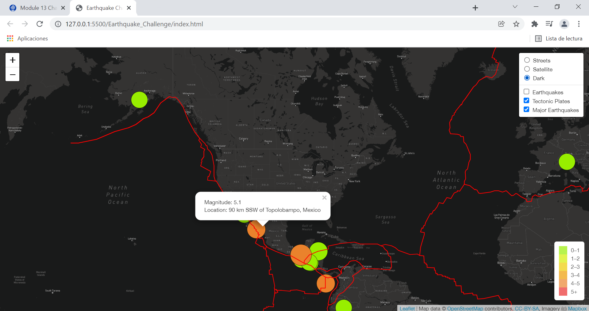

# Mapping Earthquakes

## Overview

## Resources
  - Language: JavaScript
  - API: Leaflet 1.7.1 and MapBox
  - Development tool: VS Code and Google DevTools 
  - Web Design tools: HTML5, Bootstrap 3 and CSS
  - Data source GeoJSON format: PB2002_boundaries.json and 4.5_week.geojson

## Results

1. Using JavaScript, Leaflet.js, and geoJSON PB2002_boundaries.json data, a tectonic plate data is added on the map using d3.json(), and the data using the geoJSON() layer. The tectonic plate LineString data is set on the map with the tectonic plate data to the overlay object with the earthquake data.

2. Using JavaScript, Leaflet.js, and geoJSON 4.5_week.geojson data, major earthquake data is added to the map using d3.json(). We also add color and set the radius of the circle markers based on the magnitude of earthquake with a popup marker for each earthquake that displays the magnitude and location of the earthquake using the GeoJSON layer, geoJSON().

